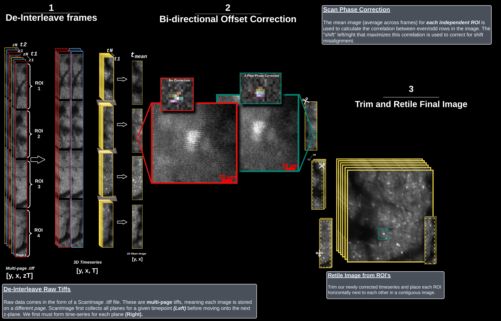

## Light Beads Microscopy (LBM) Pipeline: CaImAn-MATLAB

A pipeline for processing light beads microscopy (LBM) datasets using the [flatironinstitute/CaImAn-MATLAB](https://github.com/flatironinstitute/CaImAn-MATLAB/) pipeline.

For a python implementation, see [here](https://github.com/MillerBrainObservatory/LBM-CaImAn-Python)

## Quickstart

### Installation

To use this pipeline, the code in this repository needs to be on your `MATLAB path`. You can do this easily by:
1. Downloading the code via the blue `<> Code` button above, and select -> `Download`
2. Find your matlab path by opening MATLAB and entering `userpath`
3. Extract this downloaded folder anywhere listed here on your MATLAB path, typically `C:/Users/<Username>/Documents/MATLAB/`
4. Right click on "core" and "packages" folders -> `Add to Path` -> `Selected Folders and Subfolders`

When re-opening MATLAB, you may need to re-add the `core` and `package` folders to your path. You could similarly add
an `addpath(genpath(fullfile(path/to/code))` to prevent this.

For more details about installation, including with `git`, on different operating systems, see the [installation docs](https://millerbrainobservatory.github.io/LBM-CaImAn-MATLAB/get_started/install.html).

### Demo Pipeline

The best way to begin with this pipeline is the `demo_LBM_pipeline.m` file at the root of this project.
Modifications of this pipeline script are included in the use_cases folder.

For the last step in the pipeline, you will need 2 calibration files aquired before the experiment:

`pollen_sample_calibraion_xy.mat`
`pollen_calibration_z_vs_N.fig`

### Requirements

- MATLAB (Tested on 2023a, 2024a)
- Windows 10 or Ubuntu 22.04
- Toolboxes:
  - Parallel Computing Toolbox
  - Statistics and Machine Learning Toolbox
  - Image Processing Toolbox
  - Signal Processing Toolbox

The pipeline won't work with MacOS without the correct `mex` binaries. If this needed, submit an issue.

The most up to date mexfiles are always kept in the [releases](https://github.com/MillerBrainObservatory/LBM-CaImAn-MATLAB/releases/tag/v2.1.0-mex>) on Github.

## Overview

This pipeline is unique only in the routines to extract raw data from [ScanImage BigTiff files](https://docs.scanimage.org/Appendix/ScanImage%2BBigTiff%2BSpecification.html#scanimage-bigtiff-specification), as is outlined below:

Once data is extracted to an intermediate filetype `h5`, `.tiff`, `.memmap`, registration, segmentation and deconvolution can all be performed as described in the corresponding pipelines documentation.

Follow the root `demo_LBM_pipeline.m` file for an example pipeline, or the root `/notebooks` folder for more in-depth exploration of individual pipeline steps.

There are several utility functions you can take advantage of in the `core/utils` folder/. Learn about them in the docstrings via the [api documentation](https://millerbrainobservatory.github.io/LBM-CaImAn-MATLAB/api/index.html).

## Algorithms

The following algorithms perform the main computations and are included by default in the pipeline:

- [CNMF](https://github.com/simonsfoundation/NoRMCorre) segmentation and neuronal source extraction.
- [NoRMCorre](https://github.com/flatironinstitute/NoRMCorre) piecewise rigid motion correction.
- [constrained-foopsi](https://github.com/epnev/constrained-foopsi) constrained deconvolution spike inference.

