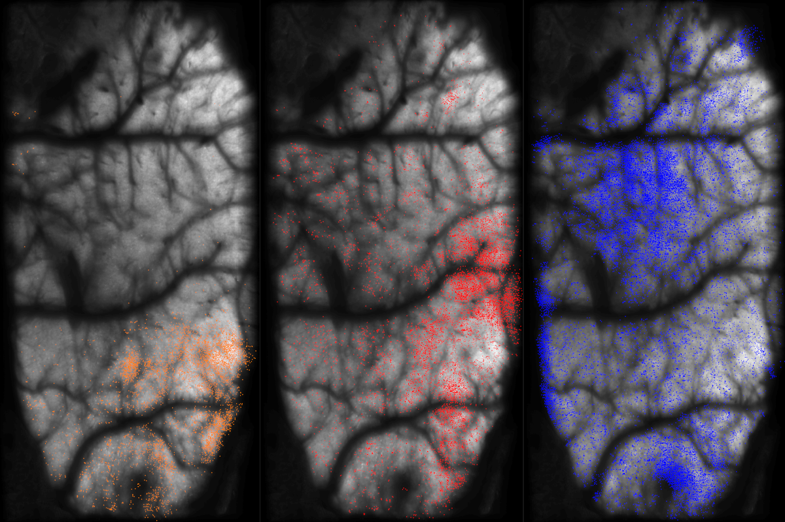

########################################
Light Beads Microscopy (LBM) Pipeline
########################################

A pipeline for processing light beads microscopy (LBM) datasets.

For background, theory and design of LBM technology, see the reference `publication`_.

Currently, inputs to this pipeline are limited to `ScanImage`_ tiff files. However, only the
first step of this pipeline which converts the multi-ROI .tiff into a 4D volumetric time-series
requires scanimage .tiff files.

Quickstart
=============

The easiest way to get started with the pipeline is to follow the LBM_demo_pipeline script.

Pipeline Steps
*****************

There are 4 core steps in this pipeline:

:func:`convertScanImageTiffToVolume()`
:func:`motionCorrectPlane()`
:func:`segmentPlane()`
:func:`collatePlane()`

Requirements
=============

- MATLAB (Tested on 2023a, 2023b, 2024b)
- Toolboxes:
    - Parallel Computing Toolbox
    - Statistics and Machine Learning Toolbox
    - Image Processing Toolbox

Algorithms
=============

The following algorithms perform the main computations and are included by default in the pipeline:

- `CNMF`_ segmentation and neuronal source extraction.
- `NoRMCorre`_ piecewise rigid motion correction.
- `constrained-foopsi`_ constrained deconvolution spike inference.

See the (WIP) Documentation for more information.

.. _CNMF: https://github.com/simonsfoundation/NoRMCorre
.. _CaImAn: https://github.com/flatironinstitute/CaImAn-MATLAB/
.. _ScanImage: https://www.mbfbioscience.com/products/scanimage/
.. _publication: https://www.nature.com/articles/s41592-021-01239-8/
.. _MROI: https://docs.scanimage.org/Premium%2BFeatures/Multiple%2BRegion%2Bof%2BInterest%2B%28MROI%29.html#multiple-region-of-interest-mroi-imaging/
.. _DataSheet: https://docs.google.com/spreadsheets/d/13Vfz0NTKGSZjDezEIJYxymiIZtKIE239BtaqeqnaK-0/edit#gid=1933707095/
.. _MBO: https://mbo.rockefeller.edu/
.. _Slides: https://docs.google.com/presentation/d/1A2aytY5kBhnfDHIzNcO6uzFuV0OJFq22b7uCKJG_m0g/edit#slide=id.g2bd33d5af40_1_0/
.. _NoRMCorre: https://github.com/flatironinstitute/NoRMCorre/
.. _constrained-foopsi: https://github.com/epnev/constrained-foopsi/
.. _startup.m: https://www.mathworks.com/help/matlab/matlab_env/matlab-startup-folder.html
.. _startup: https://www.mathworks.com/help/matlab/matlab_env/matlab-startup-folder.html
.. _BigTiffSpec: _https://docs.scanimage.org/Appendix/ScanImage%2BBigTiff%2BSpecification.html#scanimage-bigtiff-specification
