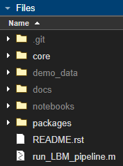

Installation
############

Install Recommendation
****************************************

The easiest way to download the source code is to visit the `github repository <https://github.com/ru-rbo/caiman_matlab.git>`_.

The most reliable installation method is to clone/download the repository and move it into a folder on your `userpath`:

.. code-block:: MATLAB

    >> userpath

    ans =
        '/home/<username>/Documents/MATLAB'

Additionally, you can create a `startup.m`_ file located in this same `userpath` directory: `~/Documents/MATLAB/startup.m` and add the following code snippet:

.. code-block:: MATLAB

   % <HOME>/Documents/MATLAB/startum.m
   % note "fullfile" isnt needed, but helpfully provides directory autocompletion
   addpath(genpath(fullfile("path/to/caiman_matlab")))

You can tell if the pipeline is added successfully to the path by looking at the file window:

.. _manual_path:

Notice `/core` and `/packages` are both bright in the files window, this indicates those folders are properly in the MATLAB path but does **not** mean that within that directory, all subdirectories are also on the path. These two folders contain all of the code the pipeline needs to run and are the only two foldrs that **must** be on the path.

By Operating System
****************************************

Modern versions of matlab (2017+) solve most Linux/Windows filesystem conflicts. Installation is similar independent of OS.

Windows
=================

The easiest method to download this repository with git is via `mysys <https://gitforwindows.org/>`_
Or just download the code from code/Download.zip above and unzip to a directory of your choosing.

.. note::

    If you have MATLAB installed on Windows, you won't be able to run commands from within WSL (i.e. //wsl.localhost/)
    due to the separate filesystems. Pay attention to which environment you install.

WSL2 (Windows Subsystem for Linux)
****************************************

Windows subsystem for Linux (WSL/WSL2) is a local environment on your windows machine that is capable of running linux commands using a separate filesystem. As of 2024, Mathworks does not officially support and is not planning support for MATLAB on WSL or WSL2.
If you have MATLAB installed on Windows and wish to use this repository from a WSL instance, see `this discussion on how to accomplish this <https://ww2.mathworks.cn/matlabcentral/answers/1597219-can-microsoft-s-wslg-windows-subsystem-for-linux-gui-support-running-matlab>`_.
This means you will not be able to run matlab from the WSL filesystem (i.e. `//wsl.localhost/`), but you can use a mounted `C://` drive path like so:

.. code-block:: bash

   $ cd /mnt/c/Users/<Username>/<project-install-path>

This pipeline has been tested on WSL2, Ubuntu 22.04. Though any debian-based distribution should work.

For unix (Linux/MacOS):
****************************************

In Linux, Mac, WSL or mysys, clone this repository with the pre-installed git client:

.. code-block:: bash

    $ cd ~/Documents/MATLAB
    $ git clone https://github.com/ru-rbo/caiman_matlab.git
    $ cd caiman_matlab
    $ matlab

Find MATLAB Install Location:
=============================

The location of the installation is often in `~/Documents/MATLAB/`.
If you put the root directory elsewhere, you will need to navigate to that directory within the matlab GUI.

Modern versions of MATLAB (2017+) solve most Linux/Windows filesystem conflicts.

Generally, the main difference in matlab installations on unix vs windows systems is nothing more than the install path::

    Windows (64-bit):
    - C:\Program Files\MATLAB\R20XXx (64-bit MATLAB)
    - C:\Program Files (x86)\MATLAB\R20XXx (32-bit MATLAB)
    Windows (32-bit):
    - C:\Program Files\MATLAB\R20XXx
    Linux:
    - /usr/local/MATLAB/R20XXx
    Mac:
    - /Applications/MATLAB_R20XXx.app

To find your install location:

.. code-block:: MATLAB

    >> matlabroot
        ans =
            'C:\Program Files\MATLAB\R2023b'

Generally, MATLAB code should be stored in your `userpath`:

.. code-block:: MATLAB

   >> userpath
   ans =
       'C:\Users\RBO\Documents\MATLAB'

You can add the path programmatically from within matlab:

.. code-block:: MATLAB

   >> addpath(genpath("path/to/caiman_matlab"))

Otherwise, you can simply navigate to that directory within the matlab GUI or add the path to this repository as
shown in the :ref:`install recommendation`

Post-Install
=================

After installation, there a few helpful things you can do.

1) Preferences

- Prevent `.asv` files, which are essentially copies of the scripts you run. I just find these annoying.

.. thumbnail:: ../_static/_images/matlab_preferences.png
   :width: 1440

.. _startup.m: https://www.mathworks.com/help/matlab/matlab_env/matlab-startup-folder.html
.. _GITHUB_: https://github.com/ru-rbo/rbo-lbm'_

