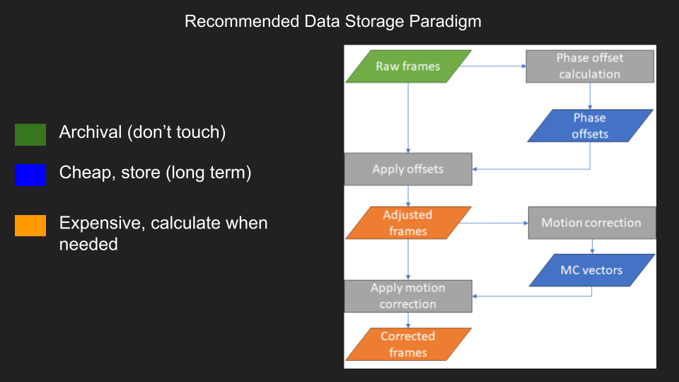

.. caiman_matlab documentation master file, created by
   sphinx-quickstart on Mon Apr 22 14:19:35 2024.
   You can adapt this file completely to your liking, but it should at least
   contain the root `toctree` directive.

#################
LBM Documentation
#################

.. _overview:

Overview
========

A pipeline for processing light beads microscopy (LBM) datasets.

For background, theory and design of LBM technology, see the reference `publication`_.

.. image:: ./_static/_images/overlays.png
   :width: 200

Currently, inputs to this pipeline are limited to `ScanImage`_ tiff files.

.. _requirements:

Requirements
------------

- MATLAB (Tested on 2023a, 2023b, 2024b)
- Toolboxes:
    - Parallel Computing Toolbox
    - Statistics and Machine Learning Toolbox
    - Image Processing Toolbox

Algorithms
----------
The following algorithms perform the main computations and are included by default in the pipeline:

- `CNMF`_ segmentation and neuronal source extraction.
- `NoRMCorre`_ piecewise rigid motion correction.
- `constrained-foopsi`_ constrained deconvolution spike inference.

Quickstart
----------

There are 4 steps that require user input:

1. Convert ScanImage .Tiff to 4D [x, y, z, t] array.
    - convertScanImageTiffToVolume
2. Piecewise rigid motion correction.
    - motionCorrectPlane
3. Plane-by-plane 2D neuronal segmentation and deconvolution.
    - segmentPlane
4. Z Offset Correction.
    - calculateZOffset
    - compare_planes

.. _tips_and_tricks:

Tips and Tricks
---------------

| Run 'help <function>' in the command window for a detailed overview on function parameters, outputs and examples.

.. _convertScanImageTiffToVolume:

.. code-block:: MATLAB

   >> help convertScanImageTiffToVolume
     convertScanImageTiffToVolume Convert ScanImage .tif files into a 4D volume.

      Convert raw `ScanImage`_ multi-roi .tif files from a single session
      into a single 4D volume (x, y, z, t). It's designed to process files for the
      ScanImage Version: 2016 software.

      Parameters
      ----------
      filePath : char
          The directory containing the raw .tif files. Only raw .tif files from one
          session should be in the directory.
      saveDirPath : char, optional
          The directory where processed files will be saved. It is created if it does
          not exist. Defaults to the filePath if not provided.
      diagnosticFlag : double, logical, optional
          If set to 1, the function displays the files in the command window and does
          not continue processing. Defaults to 0.

      Notes
      -----
      The function adds necessary paths for ScanImage utilities and processes each .tif
      file found in the specified directory. It checks if the directory exists, handles
      multiple or single file scenarios, and can optionally report the directory's contents
      based on the diagnosticFlag.

      Each file processed is logged, assembled into a 4D volume, and saved in a specified
      directory as a .mat file with accompanying metadata. The function also manages errors
      by cleaning up and providing detailed error messages if something goes wrong during
      processing.

      Examples
      --------
      .. code-block:: MATLAB

            % Path to data, path to save data, diagnostic flag
            convertScanImageTiffToVolume('C:/data/session1/', 'C:/processed/', 0);
            convertScanImageTiffToVolume('C:/data/session1/', 'C:/processed/', 1); % just display files

      See also fileparts, addpath, genpath, isfolder, dir, fullfile, error, regexp, savefast

.. _CNMF: https://github.com/simonsfoundation/NoRMCorre
.. _CaImAn: https://github.com/flatironinstitute/CaImAn-MATLAB/
.. _ScanImage: https://www.mbfbioscience.com/products/scanimage/
.. _publication: https://www.nature.com/articles/s41592-021-01239-8/
.. _MROI: https://docs.scanimage.org/Premium%2BFeatures/Multiple%2BRegion%2Bof%2BInterest%2B%28MROI%29.html#multiple-region-of-interest-mroi-imaging/
.. _DataSheet: https://docs.google.com/spreadsheets/d/13Vfz0NTKGSZjDezEIJYxymiIZtKIE239BtaqeqnaK-0/edit#gid=1933707095/
.. _MBO: https://mbo.rockefeller.edu/
.. _Slides: https://docs.google.com/presentation/d/1A2aytY5kBhnfDHIzNcO6uzFuV0OJFq22b7uCKJG_m0g/edit#slide=id.g2bd33d5af40_1_0/
.. _NoRMCorre: https://github.com/flatironinstitute/NoRMCorre/
.. _constrained-foopsi: https://github.com/epnev/constrained-foopsi/
.. _startup.m: https://www.mathworks.com/help/matlab/matlab_env/matlab-startup-folder.html
.. _startup: https://www.mathworks.com/help/matlab/matlab_env/matlab-startup-folder.html
.. _BigTiffSpec: _https://docs.scanimage.org/Appendix/ScanImage%2BBigTiff%2BSpecification.html#scanimage-bigtiff-specification

Information about using, configuration, and customizing this theme.

.. toctree::
    :maxdepth: 2
    :caption: Get started:

    install
    semantics

.. toctree::
    :maxdepth: 2
    :caption: User Guide

    user_guide/index

.. toctree::
    :maxdepth: 2
    :caption: API:

    api/index

Indices and tables
==================

* :ref:`genindex`
* :ref:`modindex`
* :ref:`search`
