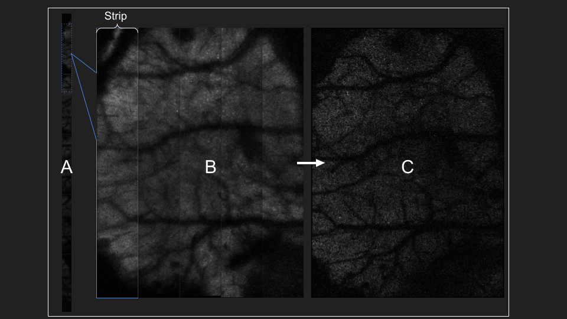
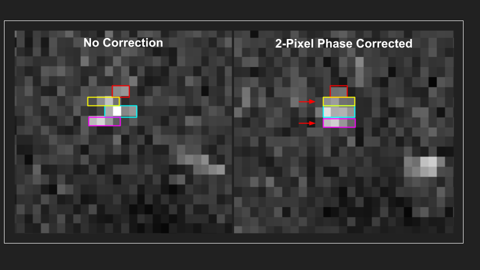

.. _pre_processing:

##############
Pre-Processing
##############

Before beginning pre-processing, follow setup steps in :ref:`getting_started` to make sure the pipeline and dependencies are installed properly.

See :ref:`troubleshooting` for common issues.

Steps
-----

Pre-processing LBM datasets consists of 2 main processing steps:

- 1 ) Reshaping vertically concatenated strips into horizontally concatenated strips
- 2 ) Peicewise motion-correction

Step 1 is accomplished through the use of `convertScanImageTiffToVolume`_ of pre-processing is shown in the image below.

Fig. part A shows the first `.tiff` page of our raw data. This strip represents sections of our image vertically concatenated.

Each Z is written before moving onto the next frame, e.g.:

- plane 1 timepoint 1, plane 2 timepoint 1, plane 3 timepoint 1, etc.

If the user choses to split frames across multiple `.tiff` files, there will be multiple tiff files in ascending order
of an suffix appended to the filename: `_000N`, where n=number of files chosen by the user.

.. important::

    All output .tiff files for a single imaging session should be placed in the same directory.
    No other .tiff files should be in this directory. If this happens, an error will throw.

You can chain the output of one function to the input of another. Note the path names match :ref:`Directory Structure`.

.. code-block:: MATLAB

    parentpath = 'C:\Users\RBO\Documents\data\bi_hemisphere\';
    raw_path = [ parentpath 'raw\'];
    extract_path = [ parentpath 'extracted2\'];
    mkdir(extract_path); mkdir(raw_path);

Setting `fix_scan_phase=true` attempts to maximize the phase-correlation between each line (row) of each strip, as shown below.

Our data are now saved as a single hdf5 file separated by file and by plane. This storage format
makes it easy to motion correct each time-series individually. We will be processing small patches of the total image,
roughly 20um in parallel, so attempting to process multiple time-series will drastically slow down NormCorre.

If the user choses to split frames across multiple `.tiff` files, there will be multiple tiff files in ascending order of an suffix appended to the filename: `_000N`, where n=number of files chosen by the user:

Single File:
- sessionX_00001.tiff

Multi File (<10):
- sessionX_00001_00001.tiff
- sessionX_00001_00002.tiff

Multi File (>=10):
- sessionX_00001_00001.tiff
- sessionX_00001_00002.tiff
- ...
- sessionX_00001_00010.tiff

Be careful to make sure that:

- Each session (series of .tiff files) should be in same directory.
- No other .tiff files should be in this directory. If this happens, an error will throw.

De-interleaving planes/frames is done via _`convertScanImageTiffToVolume`

**Output**

- After successfully running `convertScanImageTiffToVolume`, there will be a single `.h5` file containing extracted data.
- Each `.mat` contains the following fields:
    - Y: 4D (x,y,z,t) volume
    - metadata: struct of metadata retrieved through `get_metadata`

See `notebooks/Strip_Exploration` for a walkthrough on how ScanImage trims pixels and concatenates adjacent strips into a single image.

2. Motion Correction:

- Motion correction relies on _`NoRMCorre` for piecewise-rigid motion correction resulting in shifts for each patch.
- The output is a 2D column vector [x, y] with shifts that allow you to reconstruct the motion-corrected movie with _`core.utils.translateFrames`.
- shifts(:,1) represent pixel-shifts in *x*
- shifts(:,2) represent pixel-shifts in *y*

.. code-block:: MATLAB

   >> help translateFrames

     translateFrames Translate image frames based on provided translation vectors.

      This function applies 2D translations to an image time series based on
      a series of translation vectors, one per frame. Each frame is translated
      independently, and the result is returned as a 3D stack of
      (Height x Width x num_frames) translated frames.

      Inputs:
        Y - A 3D time series of image frames (Height x Width x Number of Frames).
        t_shifts - An Nx2 matrix of translation vectors for each frame (N is the number of frames).

      Output:
        translatedFrames - A 3D array of translated image frames, same size and type as Y.

See `notebooks/MC_Exploration` for a walkthrough on analyzing motion-corrected videos.
Motion correction metrics are saved to your savepath.

.. code-block:: MATLAB

    mdata = get_metadata(fullfile(metapath, metaname));
    mdata.base_filename = "MH184_both_6mm_FOV_150_600um_depth_410mW_9min_no_stimuli_00001";

    mcpath = 'C:\Users\RBO\Documents\data\bi_hemisphere\registration';
    motionCorrectPlane(extract_path, 23, 1, 3);

Perform both piecewise-rigid motion correction using `NormCORRe`_ to stabilize the imaging data. Each plane is motion corrected sequentially, so
only a single plane is ever loaded into memory due to large LBM filesizes (>35GB). A template of 150 frames is used to initialize a "reference image". This image is
your "ground truth" per-se, it is the image you want to most accurately represent the movement in your video.

For input, use the same directory as `savePath` parameter in `convertScanImageTiffToVolume`_.

