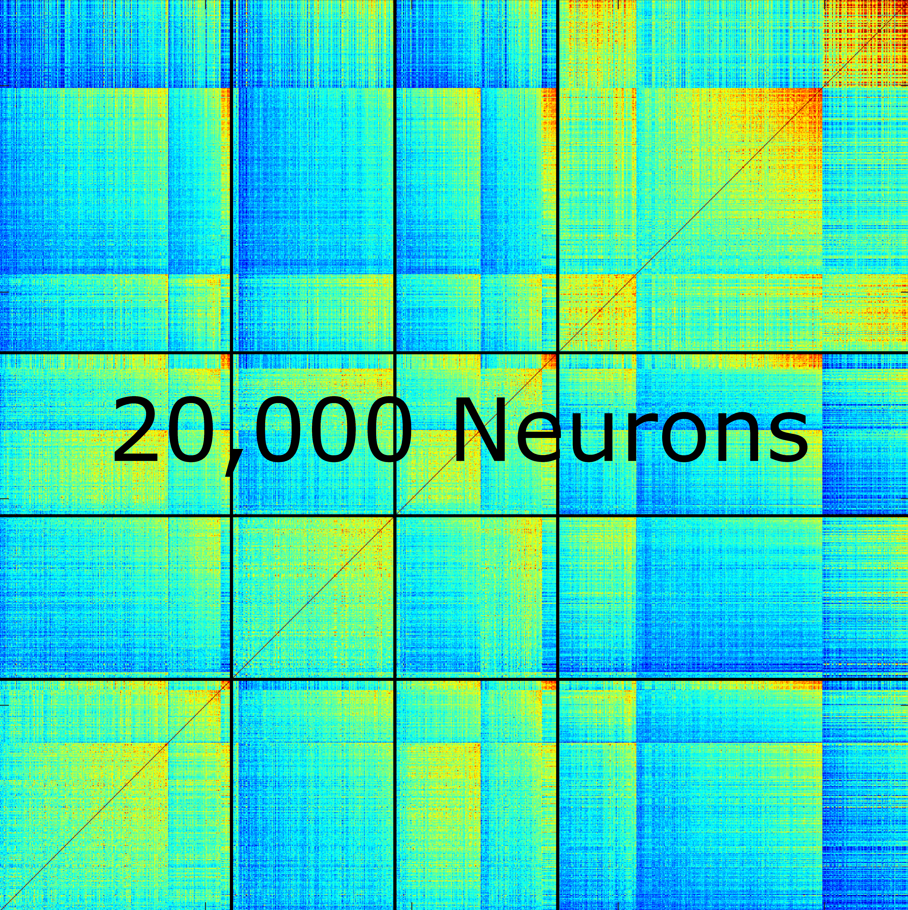

.. _segmentation_deconvolution:

Segmentation and Deconvolution
###########################################

Overview
==================

The flourescence of the proteins in our neurons is **correlated** with how active the neuron is.
Turning this flourescence into "spikes" relies on several operations:

- Use `matfile` to load parameters of the motion-corrected movie without loading the entire movie into memory.
- Set parameters for CNMF.
- Perform patched, piecewise, volumetric CNMF.
- Save outputs containing both neuropil and accepted/rejected components.

segmentPlane.m
- construct_patches.m (caiman)
- run_CNMF_patches.m (caiman)
- classify_components.m (caiman)
- compute_event_exceptionality (caiman)
- update_temporal_components (caiman)
- detrend_df_f (caiman - modified)
- AtoAc

Dependencies: CaImAn_Utilities

.. note::

    No time threshold is used for component validation.

Function Usage
====================================

segmentPlane
************************************

:ref:`segmentPlane` contains the bulk of the computational complexity in this pipeline and will take significantly longer than the previous steps.

Inputs to :ref:`segmentPlane` are similar to those seen previously. Most importantly:

- data_path: full path to motion-corrected `.mat` files::

    data_path should contain a single .mat file for **each 3D planar time-series**

    The pipeline forces filenames to contain _plane_N.mat, which is used to isolate only motion-corrected
    mat files for this session.

- save_path: full path to a folder where you would like to save the neuron/neuropil components and traces::

    This will, as of v0.2.0, overwrite any previously obtained data in this folder.

When running :ref:`segmentPlane`, check the command window for reports that match the number of files you expect to be processed:

.. code-block:: MATLAB

    Processing 30 files found in directory C:\Users\<username>\Documents\data\bi_hemisphere\registration\...  %% our data_path
    Beginning calculations for plane 1 of 30...  %% check this matches the number of Z-Planes you expect
    Data loaded in. This process takes 0.024489 minutes.
    Beginning patched, volumetric CNMF...

AtoAc
====================================

Turn the CaImAn output A (sparse, spatial footprints for entire FOV) into Ac (sparse, spatial footprints localized around each neuron).
- Standardizes the size of each neuron's footprint to a uniform (4*tau+1, 4*tau+1) matrix, centered on the neuron's centroid [acx x acy].

.. image:: ../_static/_images/sparse_rep.png
   :width: 600

Component Validation
====================================

The key idea for validating our neurons is that **we know how long the brightness indicating neurons activity should stay bright** as a function
of the number of frames. That is, our calcium indicator (in this example: GCaMP-6s), with a rise-time of 250ms and a decay-time of 500ms = 750ms, while we
record at 4.7 frames/second = “Samples per transient\=round(4.7Hz×(0.2s+0.55s))\=3”

- Use the decay time (0.5s) multiplied by the number of frames to estimate the number of samples expected in the movie.
- Calculate the likelihood of an unexpected event (e.g., a spike) and return a value metric for the quality of the components.
  - Normal Cumulative Distribution function, input = -min_SNR.
- Evaluate the likelihood of observing traces given the distribution of noise.

Parameters
====================================

There are many, many parameters used in segmentation and deconvolution. Many of the parameters are sensitive to the  pixel resolution and FOV of the recording. This section discusses such parameters.
The most influencial parameters hold information about the size of neurons and dynamics of the calcium indicator in time.

Tau
************************************

- Tau is the `half-size` of a neuron. If a neuron is 10 micron, tau will be a 5 micon.
- In general, round up.
- The kernel is fixed to have this decay and is not fit to the data.

merge_thresh
************************************

- The value of the correlation coefficient (between 0-1) at which two neurons are considered "the same neuron!", thus merge them.
- This correlation is done temporally.

Exact CaImAn Parameters
************************************

.. code-block:: MATLAB

    merge_thresh = 0.8;
    min_SNR = 1.4; % liberal threshold, tighten in post
    space_thresh = 0.2; % threshold for spatial components
    time_thresh = 0.0;
    sz = 0.1; % IF FOOTPRINTS ARE TOO SMALL, CONSIDER sz = 0.1
    mx = ceil(pi.*(1.33.*tau).^2);
    mn = floor(pi.*(tau.*0.5).^2); % SHRINK IF FOOTPRINTS ARE TOO SMALL
    p = 2; % order of dynamics
    sizY = size(data);
    patch_size = round(650/pixel_resolution).*[1,1];
    overlap = [1,1].*ceil(50./pixel_resolution);
    patches = construct_patches(sizY(1:end-1),patch_size,overlap);
    % number of components based on assumption of 9.2e4 neurons/mm^3
    K = ceil(9.2e4.*20e-9.*(pixel_resolution.*patch_size(1)).^2);

- **merge_thresh**: Checking the temporal correlation between components that overlap in space. If they have at least 1px in common and the correlation is above the merge threshold, merge the components.
- Factorization via CNMF yields "raw" traces ("y"). These raw traces are noisy and jagged.
- Each raw trace is deconvolved via "constrained foopsi," which yields the decay (and for p=2, rise) coefficients ("g") and the vector of "spiking" activity ("S") that best explain the raw trace. S should ideally be ~90% zeros.
- S and g are then used to produce C, which (hopefully) looks like the raw trace Y, but much cleaner and smoother. The optional output YrA is equal to Y-C, representing the original raw trace.

Deconvolution
============================

TODO: put this foopsi trickyness information in "For Developers" section

FOOPSI (Fast OOPSI) is originally from "Fast Nonnegative Deconvolution for Spike Train Inference From Population Calcium Imaging" by Vogelstein et al. (2010).
- OASIS was introduced in "Fast Active Set Methods for Online Spike Inference from Calcium Imaging" by Friedrich & Paninski (2016).
- Most of the CAIMAN-MATLAB code uses OASIS, not FOOPSI, despite some functions being named "foopsi_oasis."

Branches from the main "deconvolveCa" function in MATLAB_CAIMAN:

**oasis** branches: Despite some being named "foopsi_oasis," they use OASIS math.
- foopsi_oasisAR1
- foopsi_oasisAR2
- constrained_oasisAR1
- thresholded_oasisAR1
- thresholded_oasisAR2
**constrained_foopsi** branch: Used if method="constrained" and model type is not "ar1" (e.g., ar2).
- Optimization methods: CVX (external), SPGL1 (external), LARS, dual.
**onnls** branch: Used if method="foopsi" or "thresholded" with model type="exp2" or "kernel." Based on OASIS.

.. _NoRMCorre: https://github.com/flatironinstitute/NoRMCorre/
.. _constrained-foopsi: https://github.com/epnev/constrained-foopsi/
