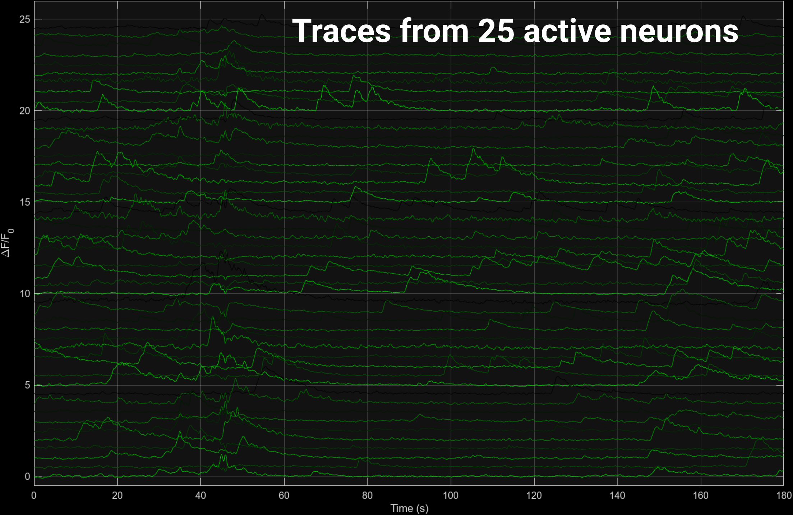

.. _source_extraction:

Segmentation
################################

Function for this step: :func:`segmentPlane()`

Segmentation Overview
========================

.. warning::

   :func:`segmentPlane()` will take significantly longer than the previous steps.

.. note::

    Much of work is about separating "good activity", the flourescence changes that we can attribute to a single cell, vs "noise, which is everything else (including signal from other neurons).
    To do this, we take advantage of the fact that the slow calcium signal is typically very similar between adjacent frames.
    See `this blog post <https://gcamp6f.com/2024/04/24/why-your-two-photon-images-are-noisier-than-you-expect/>`_ for a nice discussion on shot noise calculations and poisson processes.

The *speed of transients*, or the time it takes for the neuron to fully glow (rise time) and unglow (decay time), is a very important metric used to calculate several of the parameters for CNMF.

In particular, speed of transients relative to the frame rate can be thought of in terms of "how many frames does it take my calcium indicator to undergo a complete transients cycle".

The flourescence of the proteins in our neurons is **correlated** with how active the neuron is.
Turning this flourescence into "spikes" relies on several mathmatical operations to:

- isolate neuronal activity from background activity (segmentation).
- infer the times of action potentials from the fluorescence traces (deconvolution).

.. _seg_cnmf:

.. _seg_definitions:

Inputs
=========================

Inputs (covered in :ref:`params`) are consistent with :ref:`registration`, substituting::

    NoRMCorreSetParams -> CNMFSetParams

All of the parameters and options fed into the `CNMF` pipeline are contained within a single `MATLAB struct <https://www.mathworks.com/help/matlab/ref/struct.html>`_.

.. note::

   There is an example file describing CNMF parameters at the root of this project. :scpt:`demo_CNMF_params`.

.. _seg_tuning:

Tuning CNMF
------------------------

To get an idea of the default parameters (what happens if you use :code:`CNMFSetParams()` with no arguments),
you can run the following code to see the defaults:

.. code-block:: MATLAB

   >> opts = CNMFSetParams()

There are several different thresholds that correlation coefficients must cross to be considered a "valid" neuron or a "valid" transient signal. Below are the `CNMF` parameters that control these thresholds and allow tuning the algorithm to your dataset.

.. _seg_merge_thresh:

merge_thresh
************************************

A correlation coefficient determining the amount of correlation between pixels in time needed to consider two neurons the same neuron.

- The lower your resolution, the more "difficult" it is for CNMF to distinguish between two tight neurons, thus use a lower merge threshold.
- This parameter heavily effects the number of neurons processed. It's always better to have to many neurons vs too few, as you can never get a lost neuron back, but you can invalidate neurons in post-processing.

.. thumbnail:: ../_images/seg_traces_highcorr.svg
   :title: Example of highly correlated traces

.. _seg_minsnr:

min_SNR
************************************

The minimum "shot noise" to calcium activity to accept a neurons initialization (accept it as valid).

This value is used for an event exceptionality test, which tests the probabilty if some "exceptional events" (like a spike).

.. hint::

    **If this value is low, even a very slight deviation in signal will be considered exceptional and many background-neurons will be accepted**.

- The likeihood of observing the actual trace value over N samples given an estimated noise distribution.

- The function first estimates the noise distribution by considering the dispersion around the mode.

This probability is used to order the components according to "most likely to be exceptional".

.. _seg_tau:

Tau
************************************

Half-size of your neurons.

- Tau is the `half-size` of a neuron. If a neuron is 10 :math:`/mu`, tau will be a 5 micron.
- In general, round up.
- This changes depending on the area of the brain you're in and should be adjusted to match the ~cell size of the brain region.

.. note::

    If this parameter is not included, they will be calculated for you based on the pixel resolution, frame rate and image size in the metadata.

- For example, `Tau` is a widely talked about parameter being the half-size of your neuron.

This is calculated by default as :math:`7.5/pixelresolution`. This only makes sense if we assume an ~neuron size of `14um`.

.. _seg_p:

P
************************************

This is the autoregressive order of the system.
- It is a measure of how the signal changes with respect to time.
- This value will always be 1 or 2, depending on the frame rate of the video and the dynamics of the calcium indicator. 

.. tip::

    In general, **If your indicator takes >1 frame to rise/decay, P=2 (slow)**
    otherwise, P=1 (fast)

.. _seg_outputs:

Segmentation Outputs
============================

H5 Groups
------------

The output of the analysis includes several key variables that describe the segmented neuronal components and their corresponding activities.

Below is a description of each output variable, along with an example of how to use them and what they represent.

1. :code:`T_all`: Neuronal time-series
    - The fluorescence time-series data for each detected neuronal component. Each row corresponds to a different neuron, and each column corresponds to a different time point.
    - This data can be used to analyze the temporal dynamics of neuronal activity, such as identifying patterns of activation over time.

    .. code-block:: matlab

        plot(T_all(1, :)); % Plot the time-series for the first neuron
        xlabel('Time (frames)');
        ylabel('Fluorescence (dF/F)');

2. :code:`C_all`: Deconvolved neuronal activity
    - The deconvolved activity traces, which represent the estimated underlying neuronal firing rates. This data is derived from `T_all` through a deconvolution process that attempts to remove the effects of calcium dynamics.
    - This data can be used to study the inferred spiking activity of neurons, which is often more directly related to neuronal communication than raw fluorescence data.

    .. code-block:: matlab

        plot(C_all(1, :)); % Plot the deconvolved activity for the first neuron
        xlabel('Time (frames)');
        ylabel('Deconvolved activity');

3. :code:`N_all`: Neuronal spatial coordinates mapped to X/Y coordinates
    - A matrix where each row represents a neuron, and the columns contain properties such as the neuron's integrated fluorescence (`acm`), x-coordinate (`acx`), y-coordinate (`acy`), and z-coordinate (plane index).
    - This data can be used to analyze the spatial distribution of neurons within the imaging field and correlate spatial properties with functional data.

    .. code-block:: matlab

        scatter(N_all(:, 2), N_all(:, 3)); % Plot the spatial distribution of neurons in the xy-plane
        xlabel('x-coordinate');
        ylabel('y-coordinate');

4. :code:`Ac_keep`: Neuronal footprints
    - The spatial footprints of the detected neurons. Each neuron is represented by a 2D matrix showing its spatial extent and intensity within the imaging field.
    - This data can be used to visualize the spatial arrangement and morphology of neuronal components.

.. code-block:: MATLAB

    >> figure; imagesc(Ac_keep(:,:,1)); axis image; axis tight; axis off; colormap gray; title("Single Spatial Component");

    >> size(Ac_keep)

    ans =

        33    33   447

.. thumbnail:: ../_images/seg_ac_keep.png
   :width: 800

5. :code:`Cn`: Correlation image
    - A 2D image showing the correlation of each pixel's time-series with its neighboring pixels, highlighting areas of correlated activity.
    - This image can be used to identify regions of interest and assess the overall quality of the motion correction and segmentation process.

.. code-block:: matlab

    >> figure; imagesc(Cn); axis image; axis tight; axis off; colormap gray; title("Single Spatial Component");
    >> size(Cn) % [Y, X]

    ans =

        583 528

.. thumbnail:: ../_images/seg_cn.png
   :width: 800

.. _NoRMCorre: https://github.com/flatironinstitute/NoRMCorre/
.. _constrained-foopsi: https://github.com/epnev/constrained-foopsi/
