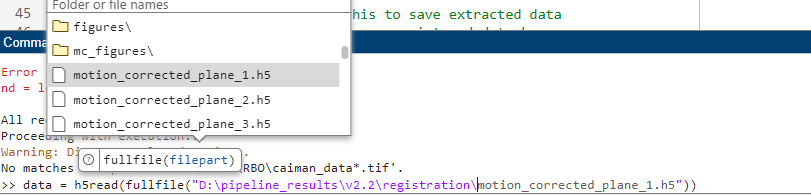

.. _tips_and_tricks:

Tips and Tricks
######################

.. _explore_data_matlab:

Exploring Datasets in MATLAB
=================================

There are several helper functions located in ``core/utils``.

.. _tnt_loading_data:

Loading Data
-----------------------

:func:`read_plane` is helper function that lets you quickly load a HDF5 plane without dealing with matlabs `h5read <https://www.mathworks.com/help/matlab/ref/h5read.html>`_ function.

You can use it using prompts:

.. code-block:: MATLAB

     Use dialog and prompts only:
         Y_out = read_plane();

.. warning::

   Make you you include the semi-colon ; after you call read_plane(), otherwise your command window will print every value in the dataset to the command window.

You can give it a folder containing H5 files, and you will be prompted for the plane and frames:

.. code-block:: MATLAB

    >> Y_out = read_plane('path/to/h5');

    Which plane do you want to read? Enter a number (e.g. 4)

    >> 4

    Which frames do you want to read? enter a slice, vector with start/stop or 'all':

    >> [1 15]

If you already know which plane you want to load, use that as a `key-value pair` (hence why you need to include `plane` before the value):

.. code-block:: MATLAB

     Y_out = read_plane('C:/data/extracted_files', 'plane', 4);

Or just give a path to the fully qualified filename of the plane you wish to read (so you no longer need the 'plane':

.. code-block:: MATLAB

    Y_out = read_plane('C:/data/extracted_files/data.h5');

Pick how many frames you want to load in a similar manner:

.. code-block:: MATLAB

     Y_out = read_plane('data.h5', 'frames', 1:10);

Or :code:`all` for everything:

.. code-block:: MATLAB

     Y_out = read_plane('data.h5', 4, 'all');

.. _tnt_mean_images:

Mean Images
-----------------------

Mean images are a good way to see small artifacts that may appear in sparse areas.

Quickly view a grid of mean images with :func:`write_mean_images_to_png`:

.. thumbnail:: ../_images/gen_mean_images.png
   :align: center

.. _tnt_making_gifs:

Making Gifs
-----------------------

:func:`write_frames_to_gif` lets you visualize your movie quickly at any stage.

.. code-block:: MATLAB

    array = rand(100, 100, 500)
    write_frames_to_gif(array, 'output.gif', 45)

You want your input array to have dimensions :code:`height x width x frames`. For very large movies, use the :code:`size_mb` parameter to limit the resulting gif to that many megabytes.

.. _tnt_quickplay:

Quick-play Movies
------------------------------

:func:`play_movie()`: Quickly view a movie of any plane.

.. code-block:: MATLAB

    % read in a motion-corrected plane
    y_extracted = read_plane('C:/data/extraction/', 'plane', 4);
    y_corrected = read_plane('C:/data/registration/', 'plane', 4);
    play_movie({y_extracted, y_corrected}, {'Raw', 'Corrected'}, 0, 255)

.. thumbnail:: ../_images/plane_1.gif
   :align: center

.. _tnt_fullfile:

Fullfile
==============

Matlabs `fullfile <https://www.mathworks.com/help/matlab/ref/fullfile.html>`_ function makes it easy to search for a filename:

.. _help_functions:

.. _tnt_functions:

Learn about Functions
============================

| Run 'help <function>' in the command window for a detailed overview on function parameters, outputs and examples.

.. code-block:: MATLAB

   >> help convertScanImageTiffToVolume
     convertScanImageTiffToVolume Convert ScanImage .tif files into a 4D volume.

      Convert raw `ScanImage`_ multi-roi .tif files from a single session
      into a single 4D volume (x, y, z, t). It's designed to process files for the
      ScanImage Version: 2016 software.

      Parameters
      ----------
      filePath : char
          The directory containing the raw .tif files. Only raw .tif files from one
          session should be in the directory.
      saveDirPath : char, optional
          The directory where processed files will be saved. It is created if it does
          not exist. Defaults to the filePath if not provided.
      diagnosticFlag : double, logical, optional
          If set to 1, the function displays the files in the command window and does
          not continue processing. Defaults to 0.

      Notes
      -----
      The function adds necessary paths for ScanImage utilities and processes each .tif
      file found in the specified directory. It checks if the directory exists, handles
      multiple or single file scenarios, and can optionally report the directory's contents
      based on the diagnosticFlag.

      Each file processed is logged, assembled into a 4D volume, and saved in a specified
      directory as a .mat file with accompanying metadata. The function also manages errors
      by cleaning up and providing detailed error messages if something goes wrong during
      processing.

      Examples
      --------
      .. code-block:: MATLAB

            % Path to data, path to save data, diagnostic flag
            convertScanImageTiffToVolume('C:/data/session1/', 'C:/processed/', 0);
            convertScanImageTiffToVolume('C:/data/session1/', 'C:/processed/', 1); % just display files

      See also fileparts, addpath, genpath, isfolder, dir, fullfile, error, regexp, savefast

.. _tnt_num_cores:

Parallel Processing
==============================

The MATLAB `parpool documentation <https://www.mathworks.com/help/parallel-computing/parpool.html>`_ and imply that parpool uses the **number of physical cores** (rather than logical) by default.
However, there are instances where the parpool shuts down due to requesting "too many logical cores", suggesting the contrary to the documentation.
You can avoid many parallel-processing related issues by **reducing the number of workers to the actual number of physical cores**:

.. code-block:: MATLAB

    p = parpool;     % NOT RECOMMENDED, CaImAn will very likely run out of resources error
    p = parpool(2);  % use only 2 parallel workers

This can vary greatly across programs and platforms. 

.. tip::

    You should first ensure the pipeline will run using <1/2 available cores before increasing the compute demands.

We can get this value in Matlab using the undocumented feature(‘numcores’) function:

.. code-block:: MATLAB

    numCores = feature('numcores');
    p = parpool(numCores);

Running :code:`feature(‘numcores’)` without assigning its output displays some general debugging information:

.. code-block:: MATLAB

    >> feature('numcores')
    MATLAB detected: 24 physical cores.
    MATLAB detected: 32 logical cores.
    MATLAB was assigned: 32 logical cores by the OS.
    MATLAB is using: 24 logical cores.
    MATLAB is not using all logical cores because hyper-threading is enabled.

    ans =

        24

You can use this return value to decide how how much of your computers total processing power should be dedicated toward running this pipeline:

.. code-block:: MATLAB

    >> feature('numcores') - 2 % leave 2 cores open for the rest of the system

    ans =

        23

This is equally valid for parfor/eval loops and spmd blocks, since both of them use the pool of workers started by parpool.

.. _tnt_matlab_install_path:

Find MATLAB Install Location
========================================

The location of the installation is often in `~/Documents/MATLAB/`.
If you put the root directory elsewhere, you will need to navigate to that directory within the matlab GUI.

Modern versions of MATLAB (2017+) solve most Linux/Windows filesystem conflicts.

Generally, the main difference in matlab installations on unix vs windows systems is nothing more than the install path::

    Windows (64-bit):
    - C:\Program Files\MATLAB\R20XXx (64-bit MATLAB)
    - C:\Program Files (x86)\MATLAB\R20XXx (32-bit MATLAB)
    Windows (32-bit):
    - C:\Program Files\MATLAB\R20XXx
    Linux:
    - /usr/local/MATLAB/R20XXx
    Mac:
    - /Applications/MATLAB_R20XXx.app

To find your install location:

.. code-block:: MATLAB

    >> matlabroot
        ans =
            'C:\Program Files\MATLAB\R2023b'

Generally, MATLAB code should be stored in your `userpath`:

.. code-block:: MATLAB

   >> userpath
   ans =
       'C:\Users\RBO\Documents\MATLAB'

You can add the path programmatically from within matlab:

.. code-block:: MATLAB

   >> addpath(genpath("path/to/caiman_matlab"))

Otherwise, you can simply navigate to that directory within the matlab GUI or add the path to this repository as
shown in the :ref:`install from source <from_source>` section.
